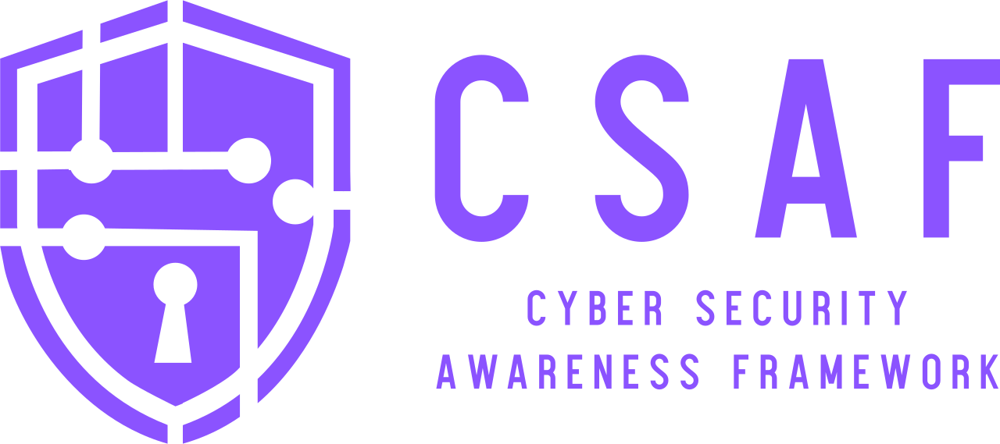

[](https://github.com/csalab-id/csaf/)
[](https://app.gitter.im/#/room/#csaf:gitter.im)
[](https://hub.docker.com/r/csalab/csaf/)
[](https://csaf.readthedocs.io/en/latest/)

The Cyber Security Awareness Framework (CSAF) is a structured approach aimed at enhancing cybersecurity awareness and understanding among individuals, organizations, and communities. It provides guidance for the development of effective cybersecurity awareness programs, covering key areas such as assessing awareness needs, creating educational materials, conducting training and simulations, implementing communication campaigns, and measuring awareness levels. By adopting this framework, organizations can foster a robust security culture, enhance their ability to detect and respond to cyber threats, and mitigate the risks associated with attacks and security breaches.

# Requirements

## Software
- Docker
- Docker-compose

## Hardware

### Minimum
- 4 Core CPU
- 10GB RAM
- 60GB Disk free

### Recommendation
- 8 Core CPU or above
- 16GB RAM or above
- 100GB Disk free or above

# Installation

Clone the repository
```
git clone https://github.com/csalab-id/csaf.git
```
Navigate to the project directory
```
cd csaf
```
Pull the Docker images
```
docker-compose --profile=all pull
```
Generate wazuh ssl certificate
```
docker-compose -f generate-indexer-certs.yml run --rm generator
```
For security reason you should set env like this first
```
export ATTACK_PASS=ChangeMePlease
export DEFENSE_PASS=ChangeMePlease
export MONITOR_PASS=ChangeMePlease
export SPLUNK_PASS=ChangeMePlease
export GOPHISH_PASS=ChangeMePlease
export MAIL_PASS=ChangeMePlease
export PURPLEOPS_PASS=ChangeMePlease
```
Start all the containers
```
docker-compose --profile=all up -d
```

You can run specific profiles for running specific labs with the following profiles
- all
- attackdefenselab
- phisinglab
- breachlab
- soclab

For example
```
docker-compose --profile=attackdefenselab up -d
```

# Proof
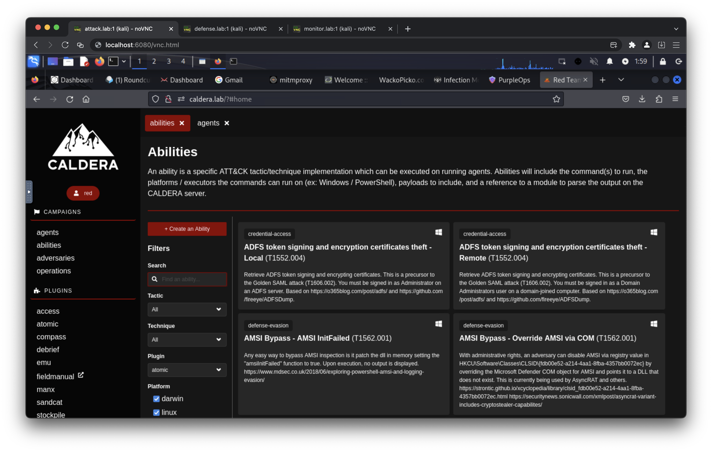
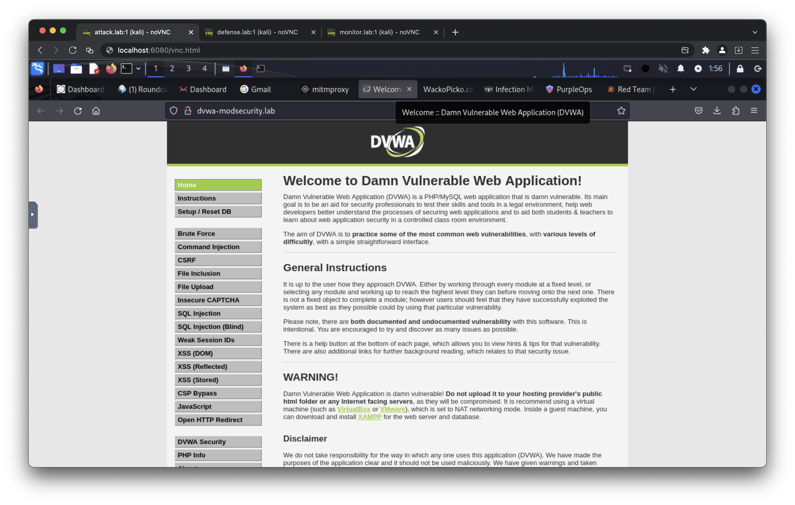
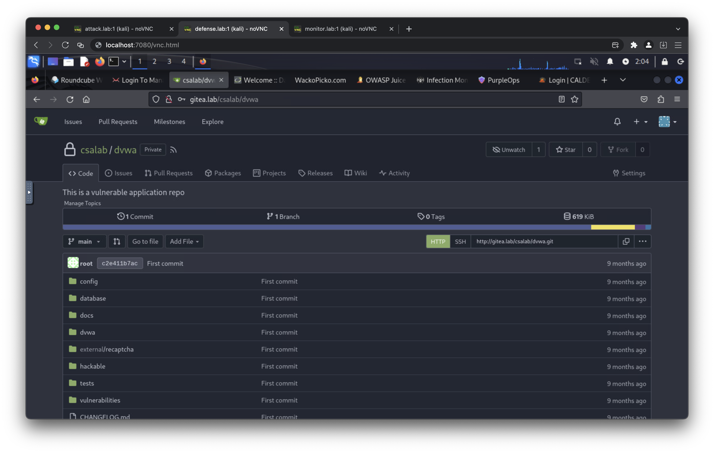
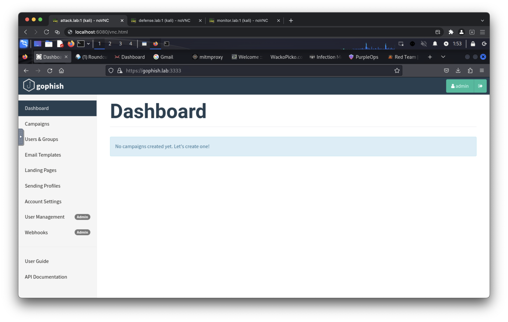
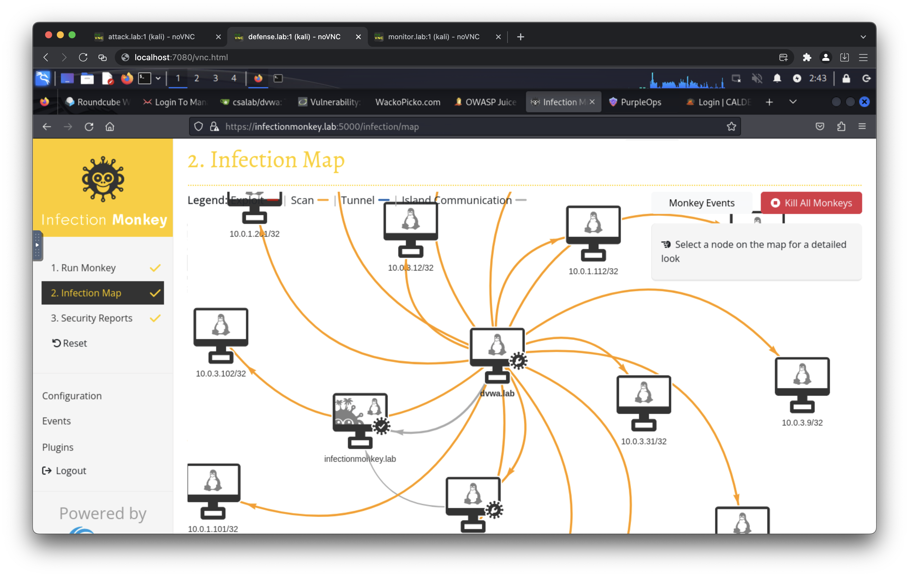
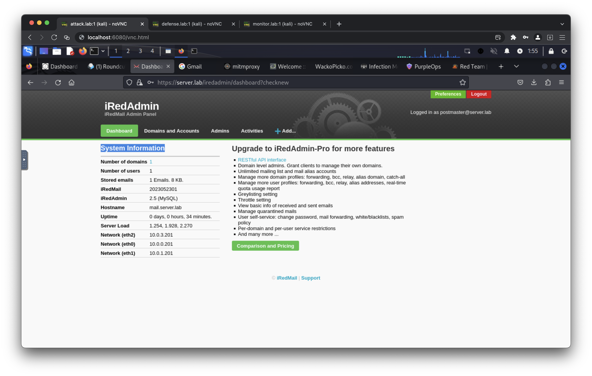
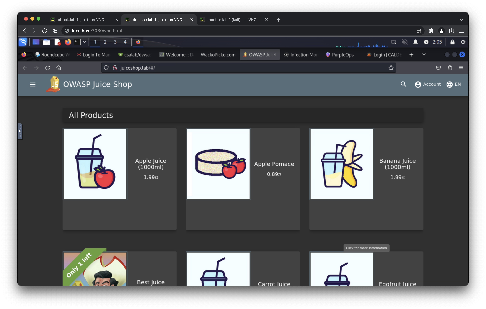
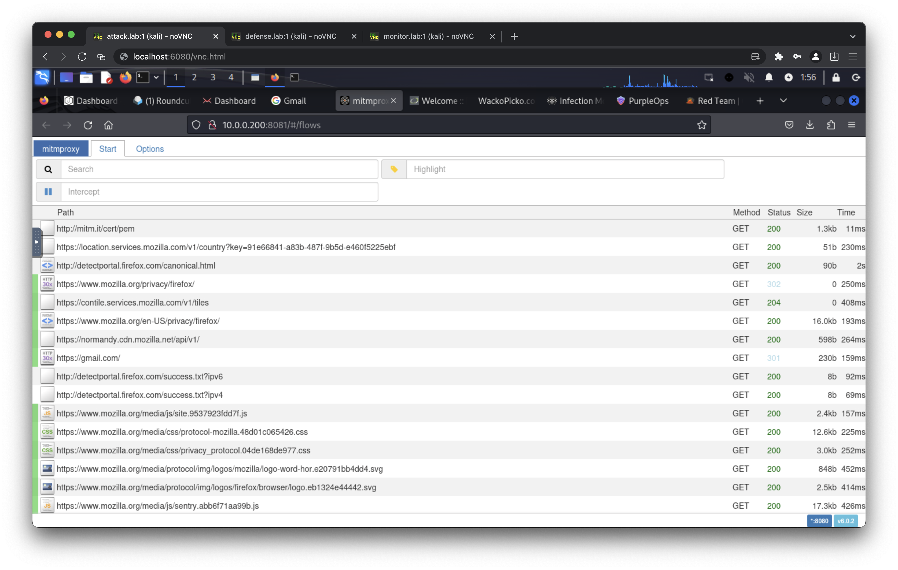
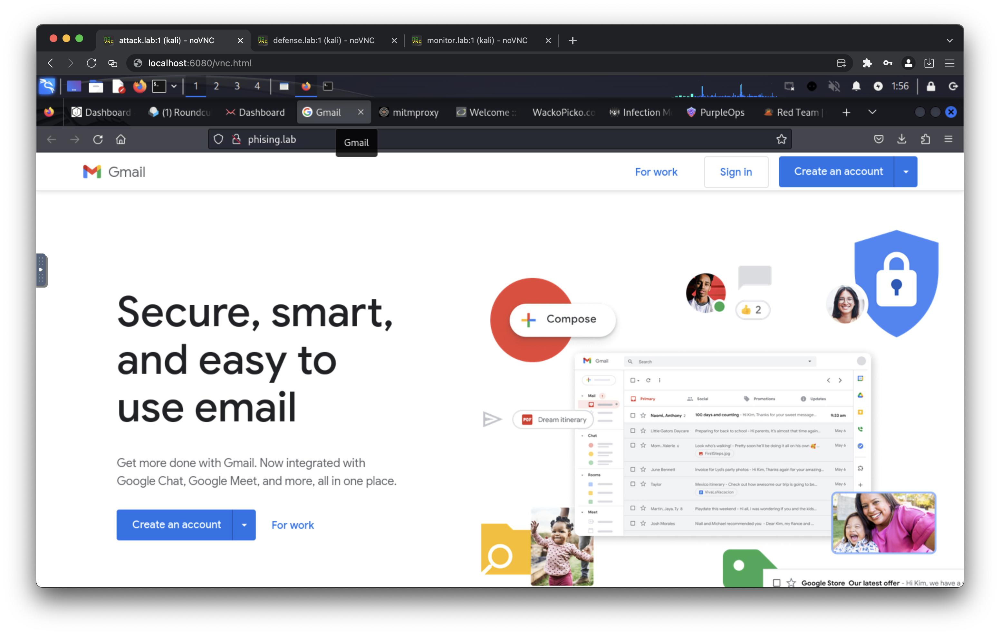
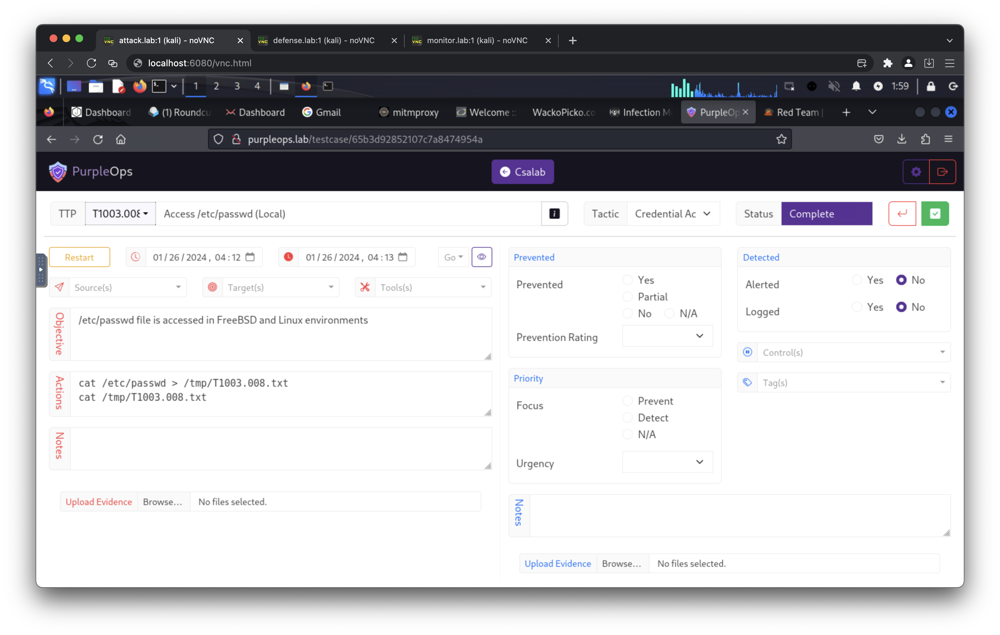
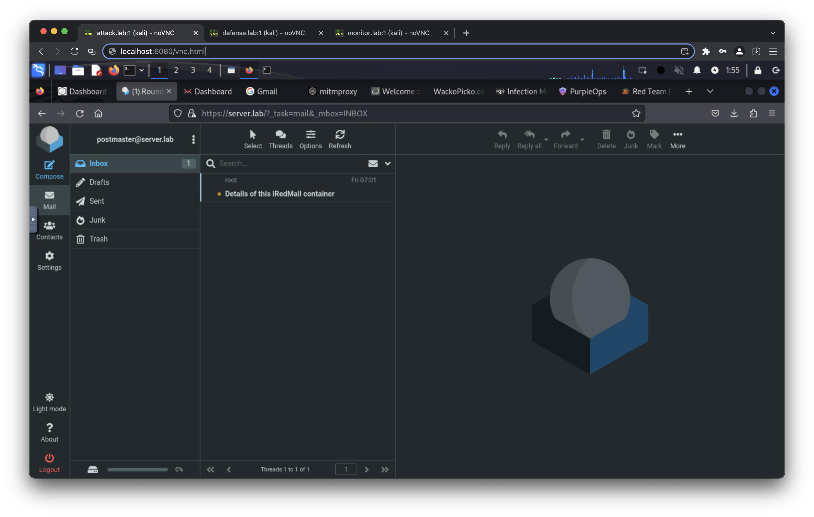
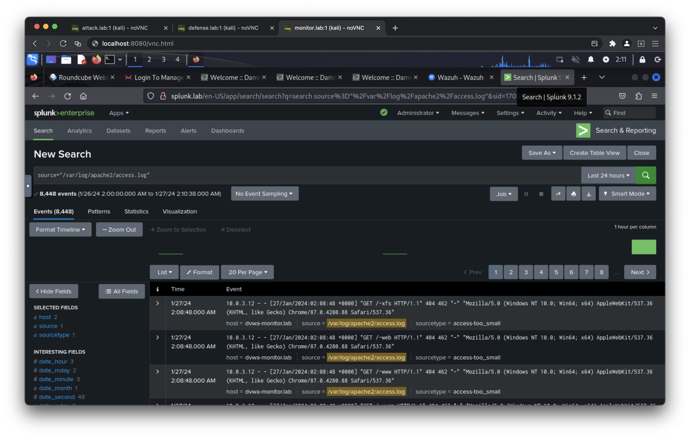
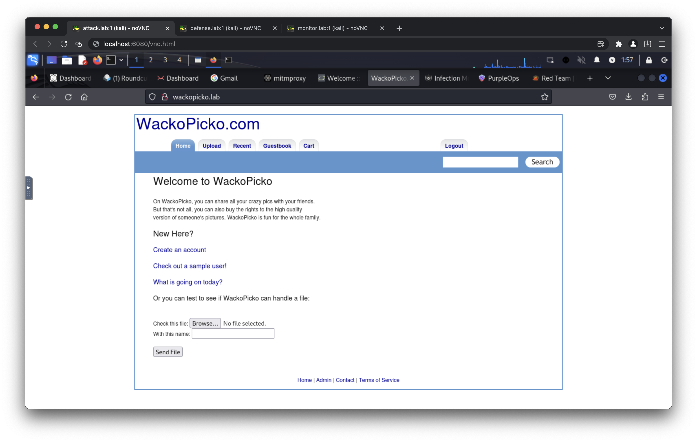
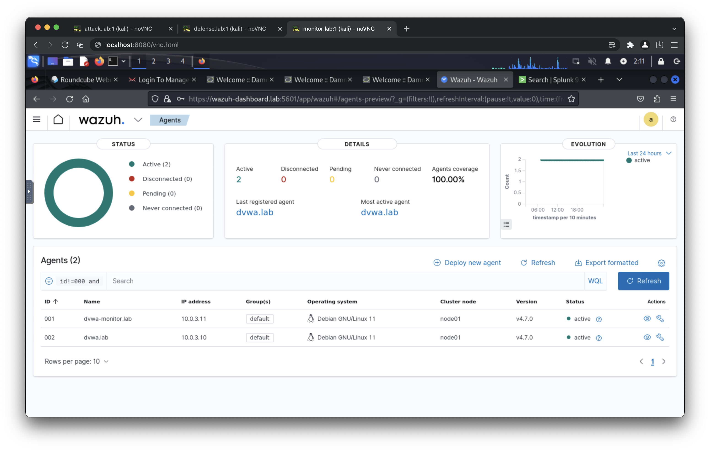

# Exposed Ports
An exposed port can be accessed using a proxy socks5 client, SSH client, or HTTP client. Choose one for the best experience.

- Port 6080 (Access to attack network)
- Port 7080 (Access to defense network)
- Port 8080 (Access to monitor network)

# Example usage
## Access internal network with proxy socks5
- curl --proxy socks5://ipaddress:6080 http://10.0.0.100/vnc.html
- curl --proxy socks5://ipaddress:7080 http://10.0.1.101/vnc.html
- curl --proxy socks5://ipaddress:8080 http://10.0.3.102/vnc.html

## Remote ssh with ssh client
- ssh kali@ipaddress -p 6080 (default password: attackpassword)
- ssh kali@ipaddress -p 7080 (default password: defensepassword)
- ssh kali@ipaddress -p 8080 (default password: monitorpassword)

## Access kali linux desktop with curl / browser
- curl http://ipaddress:6080/vnc.html
- curl http://ipaddress:7080/vnc.html
- curl http://ipaddress:8080/vnc.html

# Domain Access
- http://attack.lab/vnc.html (default password: attackpassword)
- http://defense.lab/vnc.html (default password: defensepassword)
- http://monitor.lab/vnc.html (default password: monitorpassword)
- https://gophish.lab:3333/ (default username: admin, default password: gophishpassword)
- https://server.lab/ (default username: postmaster@server.lab, default passowrd: mailpassword)
- https://server.lab/iredadmin/ (default username: postmaster@server.lab, default passowrd: mailpassword)
- https://mail.server.lab/ (default username: postmaster@server.lab, default passowrd: mailpassword)
- https://mail.server.lab/iredadmin/ (default username: postmaster@server.lab, default passowrd: mailpassword)
- http://phising.lab/
- http://10.0.0.200:8081/
- http://gitea.lab/ (default username: csalab, default password: giteapassword)
- http://dvwa.lab/ (default username: admin, default passowrd: password)
- http://dvwa-monitor.lab/ (default username: admin, default passowrd: password)
- http://dvwa-modsecurity.lab/ (default username: admin, default passowrd: password)
- http://dvwa-teler-proxy.lab/ (default username: admin, default passowrd: password)
- http://wackopicko.lab/
- http://juiceshop.lab/
- https://wazuh-indexer.lab:9200/ (default username: admin, default passowrd: SecretPassword)
- https://wazuh-manager.lab/
- https://wazuh-dashboard.lab:5601/ (default username: admin, default passowrd: SecretPassword)
- http://splunk.lab/ (default username: admin, default password: splunkpassword)
- https://infectionmonkey.lab:5000/
- http://purpleops.lab/ (default username: admin@purpleops.com, default password: purpleopspassword)
- http://caldera.lab/ (default username: red/blue, default password: calderapassword)

# Network / IP Address

## Attack
- 10.0.0.100 attack.lab
- 10.0.0.200 phising.lab
- 10.0.0.201 server.lab
- 10.0.0.201 mail.server.lab
- 10.0.0.202 gophish.lab
- 10.0.0.110 infectionmonkey.lab
- 10.0.0.111 mongodb.lab
- 10.0.0.112 purpleops.lab
- 10.0.0.113 caldera.lab

## Defense
- 10.0.1.101 defense.lab
- 10.0.1.10 dvwa.lab
- 10.0.1.13 wackopicko.lab
- 10.0.1.14 juiceshop.lab
- 10.0.1.20 gitea.lab
- 10.0.1.110 infectionmonkey.lab
- 10.0.1.112 purpleops.lab
- 10.0.1.113 caldera.lab

## Monitor
- 10.0.3.201 server.lab
- 10.0.3.201 mail.server.lab
- 10.0.3.9 mariadb.lab
- 10.0.3.10 dvwa.lab
- 10.0.3.11 dvwa-monitor.lab
- 10.0.3.12 dvwa-modsecurity.lab
- 10.0.3.15 dvwa-teler-proxy.lab
- 10.0.3.102 monitor.lab
- 10.0.3.30 wazuh-manager.lab
- 10.0.3.31 wazuh-indexer.lab
- 10.0.3.32 wazuh-dashboard.lab
- 10.0.3.40 splunk.lab

## Public
- 10.0.2.101 defense.lab
- 10.0.2.13 wackopicko.lab

## Internet
- 10.0.4.15 dvwa-teler-proxy.lab
- 10.0.4.102 monitor.lab
- 10.0.4.30 wazuh-manager.lab
- 10.0.4.32 wazuh-dashboard.lab
- 10.0.4.40 splunk.lab

## Internal
- 10.0.5.100 attack.lab
- 10.0.5.12 dvwa-modsecurity.lab
- 10.0.5.13 wackopicko.lab
- 10.0.5.15 dvwa-teler-proxy.lab

# License
This Docker Compose application is released under the MIT License. See the [LICENSE](https://www.mit.edu/~amini/LICENSE.md) file for details.
