[](https://github.com/csalab-id/csaf/)
[](https://app.gitter.im/#/room/#csaf:gitter.im)
[](https://hub.docker.com/r/csalab/csaf/)
[](https://csaf.readthedocs.io/en/latest/)

The Cyber Security Awareness Framework (CSAF) is a structured approach aimed at enhancing cybersecurity awareness and understanding among individuals, organizations, and communities. It provides guidance for the development of effective cybersecurity awareness programs, covering key areas such as assessing awareness needs, creating educational materials, conducting training and simulations, implementing communication campaigns, and measuring awareness levels. By adopting this framework, organizations can foster a robust security culture, enhance their ability to detect and respond to cyber threats, and mitigate the risks associated with attacks and security breaches.

# Architecture

```mermaid
flowchart TD
    kali_attack["Kalilinux Attack"]
    kali_defense["Kalilinux Defense"]
    kali_monitor["Kalilinux Monitor"]


    subgraph Webserver["Webserver"]
        dvwa["DVWA"]
        dvwa_monitor["DVWA Monitor"]
        wackopicko["Wackopicko"]
        juiceshop["Juiceshop"]
    end

    subgraph Database["Database"]
        mariadb["MariaDB"]
        mongodb["MongoDB"]
    end

    subgraph Phishing["Phishing LAB"]
        gophish["Gophish"]
        phishing["Phishing WEB"]
        mail_server["Mail Server"]
        mitmproxy["Mitmproxy"]
    end

    subgraph Ransomware["Ransomware LAB"]
        ransomware["Ransomware WEB"]
    end

    subgraph Breach["Breach LAB"]
        caldera["Caldera"]
        infection_monkey["Infection Monkey"]
    end

    subgraph Versioning["Versioning"]
        gitea["Gitea"]
    end

    subgraph Monitor["SOC LAB"]
        subgraph WAF["WAF"]
            bunkerweb["BunkerWEB"]
            modsecurity["Modsecurity"]
        end

        subgraph SIEM["SIEM"]
            wazuh["Wazuh"]
            splunk["Splunk"]
        end

        subgraph DFIR["DFIR"]
            velociraptor["Velociraptor"]
        end
    end

    dvwa -->|Connect| mariadb
    dvwa -->|Sending Alert| wazuh
    dvwa -->|Sending Log| splunk

    dvwa_monitor -->|Connect| mariadb
    dvwa_monitor -->|Sending Alert| wazuh
    dvwa_monitor -->|Sending Log| splunk

    wackopicko -->|Lateral Movement| juiceshop
    wackopicko -->|Lateral Movement| dvwa
    wackopicko -->|Lateral Movement| dvwa_monitor

    gitea -->|Update Code| dvwa
    gitea -->|Update Code| dvwa_monitor

    caldera -->|Control| dvwa
    caldera -->|Control| dvwa_monitor

    infection_monkey -->|Connect| mongodb

    velociraptor -->|Control| dvwa
    velociraptor -->|Control| dvwa_monitor

    bunkerweb -->|Protect| dvwa_monitor
    bunkerweb -->|Protect| wackopicko
    bunkerweb -->|Protect| juiceshop

    modsecurity -->|Protect| dvwa_monitor

    gophish -->|Sending Phishing| mail_server

    phishing -->|Seding Data| mitmproxy

    mail_server -->|Access| phishing

    ransomware -->|Infection| kali_attack
    ransomware -->|Infection| kali_defense
    ransomware -->|Infection| kali_monitor

    kali_attack -->|Attack| bunkerweb
    kali_attack -->|Attack| modsecurity
    kali_attack -->|Attack| wackopicko
    kali_attack -->|Access| gophish
    kali_attack -->|Collect Data| mitmproxy
    kali_attack -->|Access| caldera
    kali_attack -->|Access| infection_monkey

    kali_defense -->|Patch Source Code| gitea
    kali_defense -->|Control Rule| bunkerweb
    kali_defense -->|Remote SSH| dvwa
    kali_defense -->|Remote SSH| dvwa_monitor
    kali_defense -->|Access| mail_server

    kali_monitor -->|Monitor| splunk
    kali_monitor -->|Monitor| wazuh
    kali_monitor -->|Monitor| velociraptor
    kali_monitor -->|Monitor| bunkerweb
    kali_monitor -->|Access| mail_server

    %% Styling
    classDef attackStyle fill:#ff6b6b,stroke:#c92a2a,stroke-width:3px,color:#fff
    classDef defenseStyle fill:#51cf66,stroke:#2f9e44,stroke-width:3px,color:#fff
    classDef monitorStyle fill:#748ffc,stroke:#4c6ef5,stroke-width:3px,color:#fff
    classDef webserverStyle fill:#ffa94d,stroke:#fd7e14,stroke-width:2px,color:#fff
    classDef databaseStyle fill:#868e96,stroke:#495057,stroke-width:2px,color:#fff
    classDef phishingStyle fill:#ffd43b,stroke:#fab005,stroke-width:2px,color:#333
    classDef ransomwareStyle fill:#fa5252,stroke:#e03131,stroke-width:3px,color:#fff
    classDef breachStyle fill:#e64980,stroke:#c2255c,stroke-width:2px,color:#fff
    classDef versioningStyle fill:#74c0fc,stroke:#339af0,stroke-width:2px,color:#fff
    classDef wafStyle fill:#20c997,stroke:#0ca678,stroke-width:2px,color:#fff
    classDef siemStyle fill:#845ef7,stroke:#7048e8,stroke-width:2px,color:#fff
    classDef dfirStyle fill:#5c7cfa,stroke:#4263eb,stroke-width:2px,color:#fff

    %% Apply styles
    class kali_attack attackStyle
    class kali_defense defenseStyle
    class kali_monitor monitorStyle
    class dvwa,dvwa_monitor,wackopicko,juiceshop webserverStyle
    class mariadb,mongodb databaseStyle
    class gophish,phishing,mail_server,mitmproxy phishingStyle
    class ransomware ransomwareStyle
    class caldera,infection_monkey breachStyle
    class gitea versioningStyle
    class bunkerweb,modsecurity wafStyle
    class wazuh,splunk siemStyle
    class velociraptor dfirStyle

    %% Link Styling (Arrows)
    linkStyle 0,1,2,3,4,5 stroke:#868e96,stroke-width:2px
    linkStyle 6,7,8 stroke:#e64980,stroke-width:2px
    linkStyle 9,10 stroke:#74c0fc,stroke-width:2px
    linkStyle 11,12 stroke:#e64980,stroke-width:2px
    linkStyle 13 stroke:#868e96,stroke-width:2px
    linkStyle 14,15 stroke:#5c7cfa,stroke-width:2px
    linkStyle 16,17,18 stroke:#20c997,stroke-width:2px
    linkStyle 19 stroke:#20c997,stroke-width:2px
    linkStyle 20 stroke:#fab005,stroke-width:2px
    linkStyle 21 stroke:#fab005,stroke-width:2px
    linkStyle 22 stroke:#fab005,stroke-width:2px
    linkStyle 23,24,25 stroke:#fa5252,stroke-width:3px
    linkStyle 26,27,28,29,30,31,32 stroke:#ff6b6b,stroke-width:2px
    linkStyle 33,34,35,36,37 stroke:#51cf66,stroke-width:2px
    linkStyle 38,39,40,41,42 stroke:#748ffc,stroke-width:2px

    %% Subgraph Styling
    style Webserver fill:#fff4e6,stroke:#fd7e14,stroke-width:3px,color:#000
    style Database fill:#e9ecef,stroke:#495057,stroke-width:3px,color:#000
    style Phishing fill:#fff9db,stroke:#fab005,stroke-width:3px,color:#000
    style Ransomware fill:#ffe3e3,stroke:#e03131,stroke-width:3px,color:#000
    style Breach fill:#ffdeeb,stroke:#c2255c,stroke-width:3px,color:#000
    style Versioning fill:#e7f5ff,stroke:#339af0,stroke-width:3px,color:#000
    style Monitor fill:#f3f0ff,stroke:#7048e8,stroke-width:4px,color:#000
    style WAF fill:#d3f9e8,stroke:#0ca678,stroke-width:2px,color:#000
    style SIEM fill:#e5dbff,stroke:#7048e8,stroke-width:2px,color:#000
    style DFIR fill:#dbe4ff,stroke:#4263eb,stroke-width:2px,color:#000
```



# Requirements

## Software
- Docker
- Docker Compose plugin

## Hardware

### Minimum
- 8 Core CPU
- 16GB RAM
- 128GB Disk free

### Recommendation
- 12 Core CPU or above
- 32GB RAM or above
- 256GB Disk free or above

# Installation

Clone the repository
```
git clone https://github.com/csalab-id/csaf.git
```
Navigate to the project directory
```
cd csaf
```
Pull the Docker images
```
docker compose --profile=all pull
```
Generate Wazuh SSL certificate
```
docker compose -f generate-certs.yml run --rm generator
```

# Prepare .env File
Create a local environment file for Docker Compose:
```
cp .env.example .env
```
Update values in `.env` as needed, or use shell exports below.

# Environment Variables
Set these before running Docker Compose (defaults come from [docker-compose.yml](docker-compose.yml)):
- ATTACK_PASS / DEFENSE_PASS / MONITOR_PASS: VNC passwords for attack, defense, and monitor hosts (defaults: attackpassword, defensepassword, monitorpassword)
- SPLUNK_PASS: Splunk admin password (default: splunkpassword)
- VELOX_PASS: Velociraptor admin password (default: veloxpassword)
- GOPHISH_PASS: Initial Gophish admin password (default: gophishpassword)
- MAIL_PASS: First mail domain admin password for iRedMail (default: mailpassword)
- PHISHING_URL: Target URL to clone for the phishing page (default: https://gmail.com/)
- PHISHING_TITLE: Page title for the phishing site (default: Gmail)
- PHISHING_FAVICON: Favicon URL for the phishing site (default: https://www.google.com/favicon.ico)
- BIND_ADDR: Bind address for exposed attack/defense/monitor services (default: 0.0.0.0)

Example:
```
export ATTACK_PASS=ChangeMePlease
export DEFENSE_PASS=ChangeMePlease
export MONITOR_PASS=ChangeMePlease
export SPLUNK_PASS=ChangeMePlease
export VELOX_PASS=ChangeMePlease
export GOPHISH_PASS=ChangeMePlease
export MAIL_PASS=ChangeMePlease
export PHISHING_URL=https://example.com/
export PHISHING_TITLE="Example Login"
export PHISHING_FAVICON=https://example.com/favicon.ico
export BIND_ADDR=127.0.0.1
```

Start all the containers
```
docker compose --profile=all up -d
```

You can run specific labs with these profiles
- all
- attackdefenselab
- phishinglab
- breachlab
- soclab
- ransomwarelab

For example
```
docker compose --profile=attackdefenselab up -d
```

# Profiles
- all: Starts every service in the stack.
- attackdefenselab: Attack/Defense desktops, DVWA (+ secure + ModSecurity), WackoPicko, Juice Shop, Gitea, MariaDB.
- attackdefenselab: Attack/Defense desktops, DVWA (+ secure + ModSecurity), WackoPicko, Juice Shop, Gitea, MariaDB, Bunkerweb (reverse proxy/WAF).
- phishinglab: Attack desktop, Gophish, Phishing site, iRedMail server.
- breachlab: Attack/Defense desktops, DVWA, WackoPicko, Infection Monkey, MongoDB, Caldera.
- soclab: Monitor desktop, DVWA (+ secure + ModSecurity), Juice Shop, MariaDB, Wazuh (manager/indexer/dashboard), Splunk, Velociraptor, Bunkerweb (reverse proxy/WAF).
- ransomwarelab: Attack/Defense/Monitor desktops, Ransomware service.

# Services Overview
- Desktops: `attack.lab` (VNC on 6080), `defense.lab` (7080), `monitor.lab` (8080).
- Web apps: `dvwa.lab`, `wackopicko.lab`, `juiceshop.lab`, `gitea.lab`.
- Mail/Phishing: `mail.server.lab` (iRedMail), `gophish.lab`, `phishing.lab`.
- Breach simulation: `infectionmonkey.lab`, `mongodb.lab`, `caldera.lab`.
- Ransomware: `ransomware.lab`.
- SOC tooling: `wazuh-manager.lab`, `wazuh-indexer.lab`, `wazuh-dashboard.lab`, `splunk.lab`, `velociraptor.lab`.
- Security/Proxy: `bunkerweb.lab` reverse proxy/WAF for DVWA, Juice Shop, and WackoPicko. Setup UI: `https://bunkerweb.lab/setup`. Aliases: `dvwa-bunkerweb.lab`, `juiceshop-bunkerweb.lab`, `wackopicko-bunkerweb.lab`.

# Default Credentials
- VNC: `attackpassword` / `defensepassword` / `monitorpassword` (override via env).
- DVWA, WackoPicko, Juice Shop: default app passwords per app (see Domain Access list).
- Gitea: `csalab` / `giteapassword`.
- Gophish: admin password from `GOPHISH_PASS`.
- iRedMail: `postmaster@server.lab` / `mailpassword`.
- Splunk: `admin` / `splunkpassword`.
- Velociraptor: `admin` / `veloxpassword`.
- Wazuh Dashboard/Indexer: `admin` / `SecretPassword`.

# Networks
- attack: 10.0.0.0/24 (external lab attack network).
- defense: 10.0.1.0/24 (internal true) defense network.
- public: 10.0.2.0/24 (public-exposed subset).
- monitor: 10.0.3.0/24 (internal true) monitoring network.
- internet: 10.0.4.0/24 (simulated internet facing network).
- internal: 10.0.5.0/24 (service-to-service internal).

# Persistent Data
- Volumes keep state for databases and apps (MariaDB, Wazuh, Splunk, Gitea, etc.).
- Reset lab state: `docker compose down -v` removes containers and volumes.

# Lifecycle Commands
- Start (all): `docker compose --profile=all up -d`.
- Start (specific): `docker compose --profile=<profile> up -d`.
- Stop: `docker compose down`.
- Status: `docker compose ps`.
- Logs: `docker compose logs -f <service>`.

# Troubleshooting
- Certificates: Run `docker compose -f generate-certs.yml run --rm generator` before first SOC lab start.
- Bind address: Set `BIND_ADDR=127.0.0.1` to bind services locally.
- Port conflicts: Change host ports or stop conflicting processes.
- Clean slate: Use `docker compose down -v` to wipe persistent data.

# Security Notes
- Change all default passwords via `.env` before exposing services.
- Avoid exposing services broadly; prefer `BIND_ADDR=127.0.0.1` and access via SOCKS5 or SSH.
- Be cautious with email and phishing services; use test domains and isolated networks only.

# Proof


# Exposed Ports
An exposed port can be accessed using a SOCKS5 proxy, SSH client, or HTTP client. Choose one for the best experience.

- Port 6080 (Access to attack network)
- Port 7080 (Access to defense network)
- Port 8080 (Access to monitor network)

# Example Usage
## Access Internal Network with SOCKS5 Proxy
- curl --proxy socks5://ipaddress:6080 http://10.0.0.100/vnc.html
- curl --proxy socks5://ipaddress:7080 http://10.0.1.101/vnc.html
- curl --proxy socks5://ipaddress:8080 http://10.0.3.102/vnc.html

## Remote SSH with SSH Client
- ssh kali@ipaddress -p 6080 (default password: attackpassword)
- ssh kali@ipaddress -p 7080 (default password: defensepassword)
- ssh kali@ipaddress -p 8080 (default password: monitorpassword)

## Access Kali Linux Desktop (cURL/Browser)
- curl http://ipaddress:6080/vnc.html
- curl http://ipaddress:7080/vnc.html
- curl http://ipaddress:8080/vnc.html

# Domain Access
- http://attack.lab/vnc.html (default password: attackpassword)
- http://defense.lab/vnc.html (default password: defensepassword)
- http://monitor.lab/vnc.html (default password: monitorpassword)
- https://gophish.lab/ (default username: admin, default password: gophishpassword)
- https://server.lab/ (default username: postmaster@server.lab, default password: mailpassword)
- https://server.lab/iredadmin/ (default username: postmaster@server.lab, default password: mailpassword)
- https://mail.server.lab/ (default username: postmaster@server.lab, default password: mailpassword)
- https://mail.server.lab/iredadmin/ (default username: postmaster@server.lab, default password: mailpassword)
- http://phishing.lab/
- http://ransomware.lab/
- http://10.0.0.200:8081/
- http://gitea.lab/ (default username: csalab, default password: giteapassword)
- http://dvwa.lab/ (default username: admin, default password: password)
- http://dvwa-monitor.lab/ (default username: admin, default password: password)
- http://dvwa-modsecurity.lab/ (default username: admin, default password: password)
- https://bunkerweb.lab/setup
- http://dvwa-bunkerweb.lab/ (default username: admin, default password: password)
- http://wackopicko-bunkerweb.lab/
- http://juiceshop-bunkerweb.lab/
- http://wackopicko.lab/
- http://juiceshop.lab/
- https://wazuh-indexer.lab:9200/ (default username: admin, default password: SecretPassword)
- https://wazuh-manager.lab/
- https://wazuh-dashboard.lab/ (default username: admin, default password: SecretPassword)
- http://splunk.lab/ (default username: admin, default password: splunkpassword)
- https://velociraptor.lab/ (default username: admin, default password: veloxpassword)
- https://infectionmonkey.lab:5000/
- http://caldera.lab/ (default username: red/blue, default password: calderapassword)

# Network / IP Address

## Attack
- 10.0.0.100 attack.lab
- 10.0.0.200 phishing.lab
- 10.0.0.201 server.lab
- 10.0.0.201 mail.server.lab
- 10.0.0.202 gophish.lab
- 10.0.0.203 ransomware.lab
- 10.0.0.110 infectionmonkey.lab
- 10.0.0.111 mongodb.lab
- 10.0.0.113 caldera.lab

## Defense
- 10.0.1.101 defense.lab
- 10.0.1.10 dvwa.lab
- 10.0.1.13 wackopicko.lab
- 10.0.1.14 juiceshop.lab
- 10.0.1.20 gitea.lab
- 10.0.1.21 bunkerweb.lab
- 10.0.1.21 dvwa-bunkerweb.lab
- 10.0.1.21 wackopicko-bunkerweb.lab
- 10.0.1.21 juiceshop-bunkerweb.lab
- 10.0.1.110 infectionmonkey.lab
- 10.0.1.113 caldera.lab
- 10.0.1.203 ransomware.lab

## Monitor
- 10.0.3.201 server.lab
- 10.0.3.201 mail.server.lab
- 10.0.3.203 ransomware.lab
- 10.0.3.9 mariadb.lab
- 10.0.3.10 dvwa.lab
- 10.0.3.11 dvwa-monitor.lab
- 10.0.3.12 dvwa-modsecurity.lab
- 10.0.3.21 bunkerweb.lab
- 10.0.3.21 dvwa-bunkerweb.lab
- 10.0.3.21 wackopicko-bunkerweb.lab
- 10.0.3.21 juiceshop-bunkerweb.lab
- 10.0.3.102 monitor.lab
- 10.0.3.30 wazuh-manager.lab
- 10.0.3.31 wazuh-indexer.lab
- 10.0.3.32 wazuh-dashboard.lab
- 10.0.3.40 splunk.lab
- 10.0.3.41 velociraptor.lab

## Public
- 10.0.2.101 defense.lab
- 10.0.2.13 wackopicko.lab

## Internet
- 10.0.4.102 monitor.lab
- 10.0.4.30 wazuh-manager.lab
- 10.0.4.32 wazuh-dashboard.lab
- 10.0.4.40 splunk.lab
- 10.0.4.41 velociraptor.lab

## Internal
- 10.0.5.100 attack.lab
- 10.0.5.12 dvwa-modsecurity.lab
- 10.0.5.13 wackopicko.lab
- 10.0.5.21 bunkerweb.lab
- 10.0.5.21 dvwa-bunkerweb.lab
- 10.0.5.21 wackopicko-bunkerweb.lab
- 10.0.5.21 juiceshop-bunkerweb.lab

# License
This Docker Compose application is released under the MIT License. See the [LICENSE](https://www.mit.edu/~amini/LICENSE.md) file for details.

# Disclaimer
This project is intended for educational and lab use only. Do not expose any provided services directly to the internet or production environments without hardening and independent security validation. You are solely responsible for complying with applicable laws, regulations, and organizational policies when deploying or using this project.
